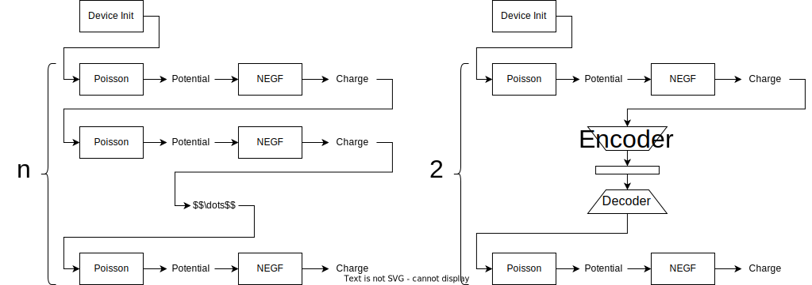

# ML_NEGF

A machine learning approach to optimizing [NEGF](https://arxiv.org/abs/2008.01275) convergence.

NEGF produces possesses different derivations. In the simplest, 1D case, NEGF generates a series of charge distributions across 2D slices of a nano device.

These 2D charge distributions are stitched together to make the solution of a real-world 3D device.

## Goal
The goal of this approach is to train a generative network on 2D charge density slices. However, unlike in traditional generative methods, the goal of the network will be to minimize the difference betweens between the charge distribution at the first and last iterations. In this way the ML model can eliminate a large number of the iteration procedure, thus saving time and resources.

## Benefits

Optimizing the convergence of NEGF will allow it to be used by industry as the cost vs performance of the method currently is too large to warrant adoption. If the model improves convergence, we can assume that NEGF will always converge in 2 steps. The first to initialize charge, and the last to guarantee physical accuracy.

## Process

